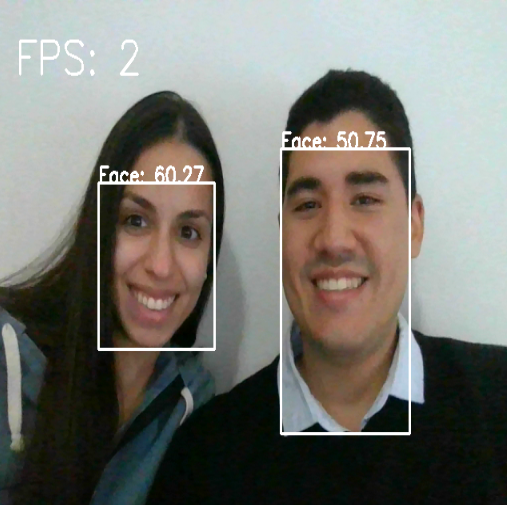

# YOLOv5: Real time face detection

Utilizando YOLOv5 se creaó un detector de caras y con OpenCV se realizó una aplicación para detectarlas en tiempo real.

* Se etiquetaron las imagenes utilizando la plataforma de [Roboflow](https://roboflow.com/).
* Fue entrenado con casi 500 imágenes de 512x512 y por apenas 50 epocas.

## Notas adicionales

* Para futuras implementaciones estaría interesante agregar más imágenes con más niveles de data augmentation y un mayor número de epocas para mejorar la precisión del modelo.
* Con una GPU la aplicación funcionaría con un mejor rendimiento.